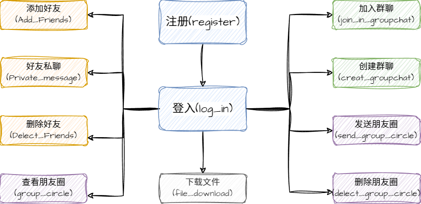

# 项目描述
##
1. 智能云在线聊天室，实现了群组系统和好友系统，因此项目可以在公共群组，私有群组和私人之间进行聊天。

2. 项目还实现了任意添加好友，删除好友，查看朋友圈，添加、删除朋友圈等功能。

3. 项目主要使用数据库实时通信技术实现聊天，通过多线程并发提高程序的效率和消息收发稳定性。

4. 项目实现了聊天记录的本地存储和优先显示，使用用户登录信息和本地记录时间戳作为过滤条件实现消息同步。

5. 项目重点编写是在后端收发逻辑，及数据的存储和同步方面。对于前端视图可能略显简陋。

#项目逻辑图

————————————————

#技术栈支持
1. LINUX 操作系统。
2. 编码工具：vscode gedit vim等。
3. 开发语言：C语言、数据结构、数据库、云服务连接。

————————————————

#概要设计

##1.数据库选择

其中使用人员注册总表存放于服务端，方便后台监控数据。每个注册人员均有数据库表，存放添加的好友、朋友圈内容，方便随时查看好友列表和朋友圈。每个群聊也拥有专属的数据库表，其中可以由管理员设置群主或普通群员，方便用户群聊数据的存储。

##2.数据结构选择

由于群聊繁多的原因，即方便用户每次上线或退出群聊后，可以方便的找到指定的群聊并快速加入群聊进行聊天，所以系统使用了顺序表联合数据库的方式进行存放数据。每个结点包括用户的文件描述符、用户的姓名、后台的数据库。

